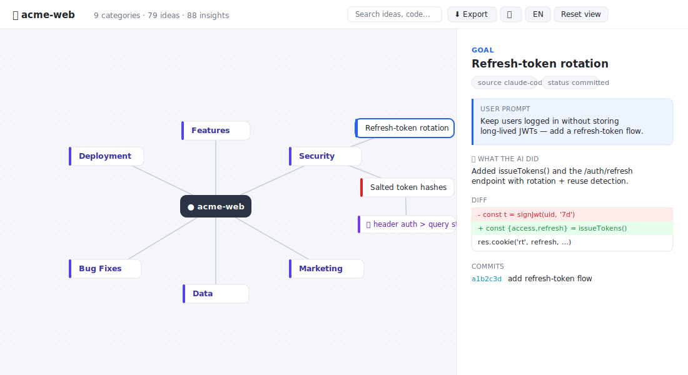

<div align="center">

# 🌳 ai-devlog

### Turn your AI coding chats into a living **idea tree**

Your sessions with Claude Code, Codex, Cursor & co. hold every decision you made —
buried in thousands of messages. **ai-devlog** digs them out and grows them into one
interactive, self‑contained HTML map of *what you built and why*.

<br/>

[](https://nodejs.org)
[](#)
[](#-what-you-get)
[](LICENSE)
[](#-the-llm-layer-optional)

<br/>



<sub>Project at the center → categories → ideas → 💡 AI insights. Click any node for the full prompt, what the AI did, the diff, and the commit. Export to Markdown/JSON, switch EN ⇄ 中, light/dark.</sub>

</div>

---

## 🤔 Why

Traditional diffs tell you **what** changed; they lose **why**. Your chat history has the
*why* — but it's an endless scroll. ai-devlog reads it, throws away the noise, and turns it
into a tree you can actually navigate.

> 把 AI 编程聊天变成项目的可审计「想法树」：每个想法、每次分叉、每个实现都能追溯。

## ✨ Features

- 🌐 **Auto‑discovers** your Claude Code & Codex sessions — no file hunting.
- 🧹 **Cuts the noise** — drops tool‑results, IDE notifications and injected reminders, so only the prompts *you actually typed* become nodes.
- 🧠 **LLM‑organized** — groups the whole project into **categories → ideas → sub‑ideas**, nesting related ideas *across conversations and time*. Runs on your **Claude subscription** (the `claude` CLI) — no API key.
- 💡 **AI insights** — pulls out the genuine findings, decisions & recommendations the AI gave you (incl. from its web research), not the busywork.
- 🔗 **Git‑correlated** — folds the real commit + diff into the idea it belongs to.
- 🌳 **Radial canvas** — pan/zoom mind‑map that fans out in every direction.
- 🌏 **Bilingual** (EN ⇄ 中) and 🌙 **light/dark**, one click each.
- ⬇ **Export** the whole tree to **Markdown** or JSON.
- 📦 **One file, zero deps, offline** — share an `index.html`, open it anywhere. Nothing is uploaded.

## 🚀 Quick start

No install, no API key — just Node 18+.

```bash
# see it instantly with sample data
npx github:YixiaJack/ai-devlog demo
# → opens ai-history-export/index.html

# …or on YOUR project: discover sessions + correlate git + LLM-organize, in one go
cd /path/to/your/project
npx github:YixiaJack/ai-devlog auto --git --summarize
```

<sub>Prefer a clone? `git clone https://github.com/YixiaJack/ai-devlog && node ai-devlog/ai-devlog.mjs demo`</sub>

## 🎨 What you get

A single self‑contained `index.html` — the whole UI is the **idea tree**:

| | |
|---|---|
| 🌳 **Radial tree** | drag to pan, scroll to zoom; the project sits at the center and ideas fan out in all directions, color‑coded by type |
| 🖱️ **Click a node** | a drawer shows the full **prompt** and **what the AI did** — its answer, files changed, red/green diff, and the git commits that landed |
| 🔎 **Search** | filter the tree to matching ideas/prompts/code and their ancestors |
| 🌏 / 🌙 | language toggle (EN ⇄ 中) and light/dark mode |

## 🧩 How it works

```
chats ──▶ normalize ──▶ filter to real prompts ──▶ LLM: classify + nest + insights ──▶ radial HTML
```

1. **Ingest** sessions from each source and normalize them to a common message stream.
2. **Filter** — keep only genuine human prompts (Claude Code's `type:"user"` is mostly tool‑results & injected context; those are dropped).
3. **Organize** — the LLM classifies the project into 3–7 **categories**, nests each idea under the one it relates to, writes a bilingual title, and extracts the AI's insights. Without the LLM, a chronological keyword heuristic is used.
4. **Render** — everything inlines into one offline HTML tree.

<details>
<summary><b>📥 Supported sources</b></summary>

<br/>

| `--source` | Input | Auto? |
|---|---|:--:|
| `claude-code` | Claude Code `*.jsonl` (`~/.claude/projects/…`) | ✅ |
| `codex` | Codex `rollout-*.jsonl` (`~/.codex/sessions/…`) | ✅ |
| `chatgpt` | ChatGPT export `conversations.json` | — |
| `aider` | `.aider.chat.history.md` | — |
| `markdown` | any markdown with `## User` / `## Assistant` headings | — |
| `generic` | JSON in ai-devlog's own schema | — |

```bash
node ai-devlog.mjs discover            # list this project's local sessions
node ai-devlog.mjs auto                # import them all + build the HTML
node ai-devlog.mjs auto --all          # every project on this machine
node ai-devlog.mjs import --source chatgpt conversations.json   # web exports stay manual
```

</details>

<details>
<summary><b>🧠 The LLM layer (optional)</b></summary>

<br/>

```bash
node ai-devlog.mjs auto --git --summarize     # one shot
# or, on an existing store:
node ai-devlog.mjs summarize                  # arrange the whole project
node ai-devlog.mjs summarize --refresh        # re-arrange from scratch
```

- Drives the headless **Claude Code CLI** (`claude -p`) — your subscription, **no API key, no SDK**.
- Classifies into 3–7 **categories**, nests ideas by meaning across conversations, and writes **bilingual** titles phrased as ideas (not commands).
- **Insights** use an include/exclude codebook (an insight answers *"what does this mean / why it matters"*, not *"what was done"*) and read the head **and tail** of each response so research conclusions aren't missed.
- Default model `haiku` (override with `--model`); cached in the store. This is the only step that sends data off your machine.

</details>

<details>
<summary><b>🔗 Git correlation</b></summary>

<br/>

```bash
node ai-devlog.mjs auto --git                 # correlate commits while building
node ai-devlog.mjs scan-git --since "30 days ago"   # then: export
```

Each commit (with its diff) is attached to the nearest preceding idea by time
(window configurable via `--window <hours>`). Commits with no nearby chat are
grouped under an **Unlinked commits** node — nothing is silently dropped.

</details>

## 🔒 Privacy

Local‑first and read‑only: ai-devlog reads files you point it at and writes a static
folder. **Nothing is uploaded** — except the optional `summarize` step, which sends idea
text to your own Claude subscription. Redact secrets before sharing an export.

## 🛠️ Run it as a command

```bash
npx github:YixiaJack/ai-devlog auto   # straight from GitHub, no clone
# or install globally from a clone:
cd ai-devlog && npm install -g . && ai-devlog auto
```

## 🗺️ Roadmap

Cursor SQLite reader · richer insight ranking · lazy‑rendered tree for huge histories ·
MCP server exposing the history as queryable resources.

## 🧱 Project layout

```
ai-devlog.mjs        CLI (auto · discover · scan-git · summarize · import · export · demo)
lib/discover.mjs     find local Claude Code + Codex sessions
lib/git.mjs          read git commits/diffs for correlation
lib/summarize.mjs    LLM categories + hierarchy + insights, via the claude CLI
lib/parsers.mjs      source → normalized messages
lib/tree.mjs         messages → project-wide idea tree
lib/exporter.mjs     tree → single self-contained HTML
template/            index.html · style.css · app.js  (SVG radial canvas, inlined on export)
```

## 📄 License

[MIT](LICENSE) · made with [Claude Code](https://claude.com/claude-code)
